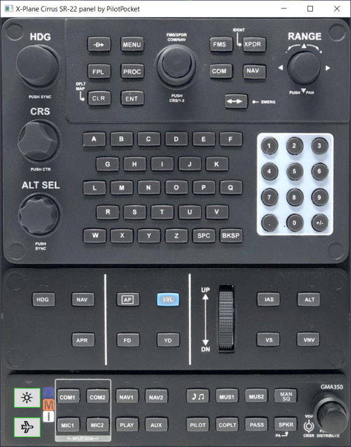
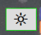
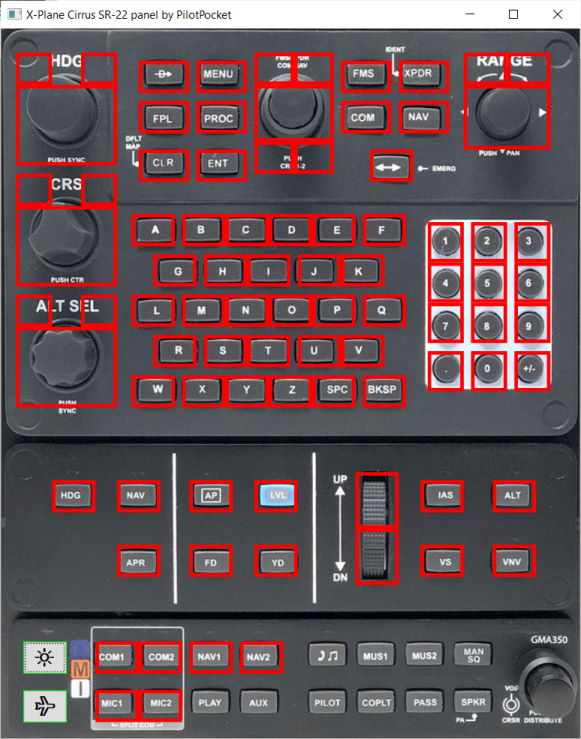
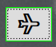
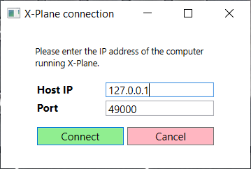

# Remote SR-22 GCU panel for X-plane 11 with Torquesim SE-22 plugin

This is the remote Cirrus SR-22 panel for Torquesim plugin of X-plane 11. 
Panel app can run on the same computer as X-plane but the separate computer with touchscreen works best.

There are two control buttons at the bottom left corner of the panel.

 Highlight button shows the areas of the control panel that can be pressed. 
Some panel buttons are not active and invisible buttons near knobs are used to turn them clockwise and counter-clockwise.

 Connection button opens the X-plane connection window. 
X-Plane network tab of the settings window shows the IP address that should be entered here. The default port usually works fine.

These connection settings are saved to the file. The next time app runs it loads connection settings from the file but the app 
does not connect to the X-Plane automatically. You would still have to open the connection winow and click on the "connect" button.

## Building the app

It is a .net core 3.1 windows 10 app which you can build easily if you have .net core 3.1 installed. Just go to the **src/SR22gcu** folder
in this repo and execute `dotnet run` command line. This would build and run the app. 

Used libraries/packages:
* The app contains code from [X-Plane connector](https://github.com/MaxFerretti/XPlaneConnector) for communications with X-Plane simulator.
* Newtonsoft.Json is used for loading and saving conection settings.

## Getting the app without building

Sorry. Not at this time. If .net core framework is installed on the system then compiled app is just 4Mb which is fine. 
However, with everything included the app is over 200Mb which seems just too big. 

